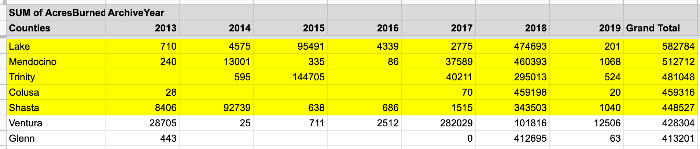

# [Ambika Dubey] J124: Final Project

## Story summary and sourcing

### Summary
The wildfires dataset can serve as the basis for a story on natural disaster preparedness per county in California. Combined with a dataset of the population of California cities and counties (see "Additional resources" below), we should be able to estimate the number of people affected by a wildfire in a given county. In addition, for further analysis we could combine analysis of the wildfire dataset (size/scope/severity over time) with a temperature or climate events dataset (see "Additional resources" below) to illustrate a correlation between the two. For example, we could explore whether drought years make for worse wildfires, or if the causes of the fires differ between draught years and otherwise.

### Potential expert sources
- Susie Kocher (@UCsierraforest | (530) 542-2571 | sdkocher@ucdavis.edu)
     - Natural Resources Advisor for the University of California, Member of the Statewide Coordinating Team for the California Fire Science Consortium
     - Kocher could be a great source to comment on trends in wildfires in California over time. She has worked on education and outreach related to fires, and could be a great source for a cautionary section of an article detailing emergency preparedness or what to do following a wildfire.
- Elizabeth F. van Mantgem ((559) 565-3170 | evanmantgem@usgs.gov)
     - US Geological Survey, Member of the Statewide California Fire Science Consortium as a Central and Southern CA region contributor
     - Mantgem would be a good source for joining California data with countrywide data and trends to extrapolate or forecast wildfires in other regions of the country based on US geological data.

### Additional resources
- [Dataset] Daily temperature in major cities [(via Kaggle)](https://www.kaggle.com/sudalairajkumar/daily-temperature-of-major-cities).
     - Joined with the wildfires dataset, this temperature dataset could help illustrate a correlation between temperature and prevalence of wildfires in California cities or counties.
- [Dataset] California cities dataset [(via Kaggle)](https://www.kaggle.com/camnugent/california-housing-feature-engineering?select=cal_populations_county.csv)
    - Joined with the wildfires dataset and the temperature dataset, this dataset gives us the ability to do more nuanced reporting on the number of people affected by a fire in a given county or city.

## Data visualization

This infographic can also be viewed at [this link](https://infogram.com/california-wildfires-1h8n6m30rl3kj4x?live).

## Data analysis and process
### Cleaning the data
* Noted that in the "Counties" column, Mexico, State of Nevada, and State of Oregon appear, and California's Imperial and San Francisco Counties do not. This did not affect most of the analysis, but was good to keep in mind as I was exploring the data.
* Some of the "CountyIds" entries have multiple Ids separated by commas. This was discovered when completing step #2 below, when I noticed that there were three entries for River Fire. This is because there is a unique entry for each county affected. This was important when analyzing total acres burned across each year since I did not want to artifically inflate values by counting large fires multiple times.
* Because of the above observation, in order to complete step #5 below, I deduplicated the data by removing rows where "CanonicalUrl" matched. This reduced the numbers I had been working with previously to give what I presume are more accurate totals.

### Questions and answers from this dataset
1. Which was California's deadliest wildfire between 2013 and 2019?
    * Butte County's Camp Fire in 2018 was the deadliest fire in this time period, resulting in 85 total fatalities.
    * Method: Sort original dataset by "Fatalities" descending, take the first one.
    * 
2. Which of the wildfires in this period has the highest number of personnel involved?
    * River Fire (Mendocino Complex), which affected Mendocino, Lake, and Colusa Counties in 2018, had the highest number of personnel involved at 3,100.
    * Method: Sort original dataset by "PersonnelInvolved" descending, take the first one. Note: There are three entries for the River Fire because it spanned three counties. This was noted for all the analysis steps involving sums but not removed for sort operations because it did not change the outcome of the analysis.
    * 
3. Which five counties were affected by the most number of fires between 2013 and 2019?
    * Riverside (146 fires), San Diego (89), Butte (66), Shasta (64), and San Luis Obispo (64) were the counties that were affected by the most number of wildfires between 2013 and 2019.
    * Method: Pivot table from the original dataset with "Counties" as rows, and COUNTA of "Name" as values, sorted by COUNTA of Name descending, take the top five.
    * 
4. Which five counties had the most number of acres burned between 2013 and 2019?
    * Lake, Mendocino, Trinity, Colusa, and Shasta were the counties that had the most number of acres burned in the time period, each with over 400k acres burned.
    * Method: Pivot table from the original dataset with "Counties" as rows, SUM of "AcresBurned" as values, and "ArchiveYear" as columns, sort by "Grand Total" descending, take the top five.
    * 
5. How many acres burned in total each year among all fires?
    * 523k acres burned in 2013, 444k in 2014, 542k in 2015, 500k in 2016, 1.42M in 2017, 1.55M in 2018, and 286k in 2019 so far according to the dataset.
    * Method: Deduplicate dataset by using "CanonicalUrl" as the unique key (fires that spanned multiple counties have multiple entries, but since we care only about the total acres burned we don't want to count these entries multiple times in the sum), pivot table from the deduplicated dataset with "Counties" as rows, "ArchiveYear" as columns, and SUM "AcresBurned" as values, take the entries for "Grand Total" row and match them to the corresponding year.
    * 

[Here](https://docs.google.com/spreadsheets/d/1mZumjclxwbMTcLb5SULyUnjb_LLmPz_sA3PAsaY4pLk/edit?usp=sharing) is a link to the dataset used for analysis.
